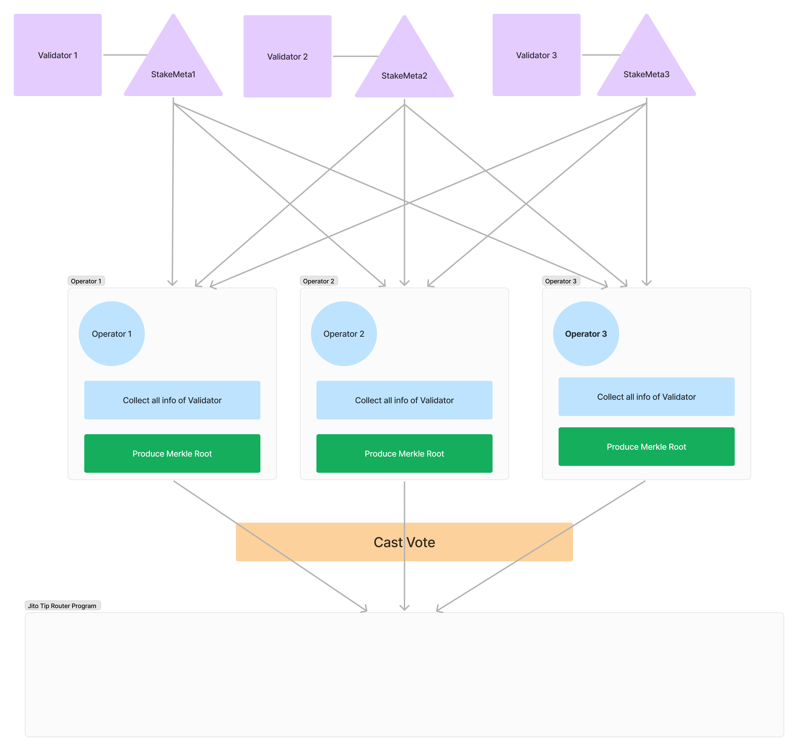
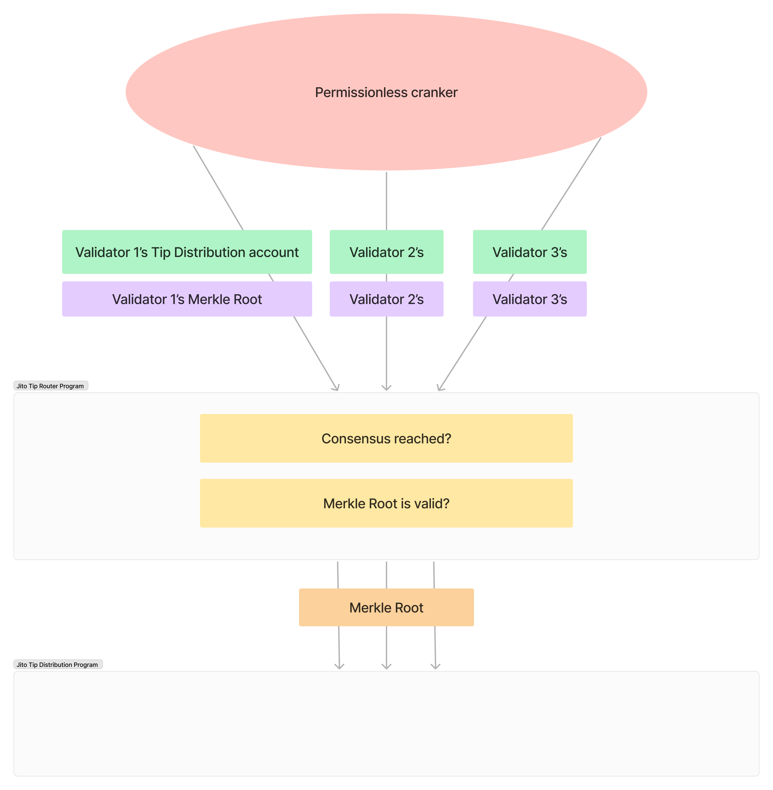

# Jito Tip Router Program

## Overview

### Current Process

- Each validator has a unique tip distribution account, owned by the [Jito Tip Distribution Program], where SOL is collected for a given epoch.
- At the end of the epoch, an off-chain process takes place which produces a merkle tree and merkle root for each validator’s tip distribution account. 
    - Validators can run this process themselves or delegate it to another party.
    - The merkle tree is intended to distribute any SOL in the account to the validator based on their MEV commission rate. Remaining funds are sent to stakers’ stake accounts pro-rata.
- After the merkle root has been uploaded, merkle proofs are uploaded on-chain and the program will transfer SOL from the tip distribution account to the validator’s vote account and stake accounts. 

### Problem

- Merkle root upload authority is permissioned with opt-in from each Jito-Solana validator. This mechanism creates a single point of potential failure with adverse impacts on network stakeholders and lacks transparency on the calculation.

### Solution

The TipRouter NCN will leverage Jito (Re)staking to empower a set of node operators to come to consensus on the correct merkle root for tip distribution.

The mechanism of the TipRouter NCN is detailed below:

- Validators can delegate the merkle root upload authority to a program derived address owned by the NCN, giving it permission [to upload merkle roots].
- After epoch rollover, node operators will each compute the merkle tree and merkle root for each validator and upload it on-chain.

- On a periodic basis, consensus of node operators will be checked. After ⅔ of stake agrees on a merkle root for a given validator, a cross program invocation will take place to upload the merkle root to the validator’s tip distribution account.

[Jito Tip Distribution Program]: https://github.com/jito-foundation/jito-programs/blob/master/mev-programs/programs/tip-distribution/src/lib.rs
[to upload merkle roots]: https://github.com/jito-foundation/jito-tip-router/blob/022fee74773170b76d1f8aad8c8edc71fd387e05/program/src/set_merkle_root.rs#L61-L80

## NCN Program

Following the [NCN design section], Jito Tip Router consists of:

- Pricing
- Snapshot
- Core Logic
- Reward Payment

[NCN design section]: /guide/ncn-design.md

### Weight Table

**Permissionless Cranker**:

Prepare several accounts like `TrackedMints` and `WeightTable`.

- [Initialize TrackedMints account](https://github.com/jito-foundation/jito-tip-router/blob/master/program/src/initialize_tracked_mints.rs)
- [Register Mint](https://github.com/jito-foundation/jito-tip-router/blob/master/program/src/register_mint.rs)
- [Initialize WeightTable account](https://github.com/jito-foundation/jito-tip-router/blob/master/program/src/initialize_weight_table.rs)

**NCN Admin**:

NCN admin update *weight* of supported token on Tip Router NCN.

- [Update WeightTable account](https://github.com/jito-foundation/jito-tip-router/blob/master/program/src/admin_update_weight_table.rs)

### Operator + Vault Snapshots

Take snapshots of Operator and Vault per epoch.

**Permissionless Cranker**:

Aggregate all information of operators and vaults associated with NCN

- [Initialize EpochSnapshot account](https://github.com/jito-foundation/jito-tip-router/blob/master/program/src/initialize_epoch_snapshot.rs)
- [Initiazize OperatorSnapshot account](https://github.com/jito-foundation/jito-tip-router/blob/master/program/src/initialize_operator_snapshot.rs)

### Consensus

**Permissionless Cranker**:

Prepare Ballot Box, all votes would be collected here.

- [Initialize Ballot Box](https://github.com/jito-foundation/jito-tip-router/blob/master/program/src/initialize_ballot_box.rs)

After consensus reached with more than 2/3, cranker can upload the merkle tree of each validator.

- [Set Merkle Root](https://github.com/jito-foundation/jito-tip-router/blob/master/program/src/set_merkle_root.rs)

**Operator**:

Each operator caluclate the merkle tree to produce merkle root then cast vote with produced merkle root.

- [Cast Vote](https://github.com/jito-foundation/jito-tip-router/blob/master/program/src/cast_vote.rs)

### Distribute Rewards

IN PROGRESS

## References
- [JIP-8: Adopt TipRouter NCN (Protocol Development)](https://forum.jito.network/t/jip-8-adopt-tiprouter-ncn-protocol-development/413)
- [Jito Tip Router Repo](https://github.com/jito-foundation/jito-tip-router/tree/master)
